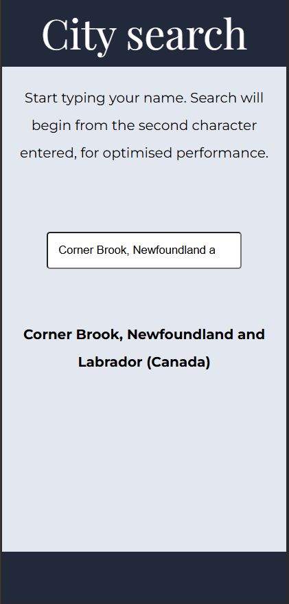
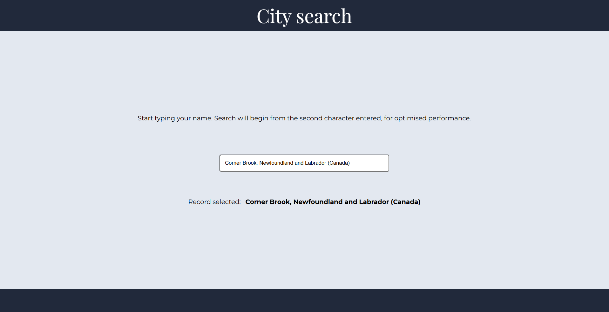
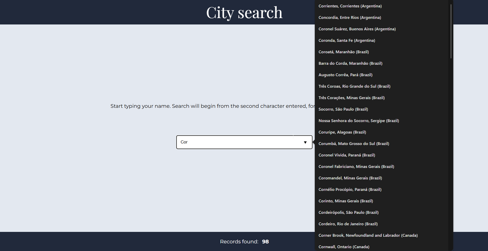
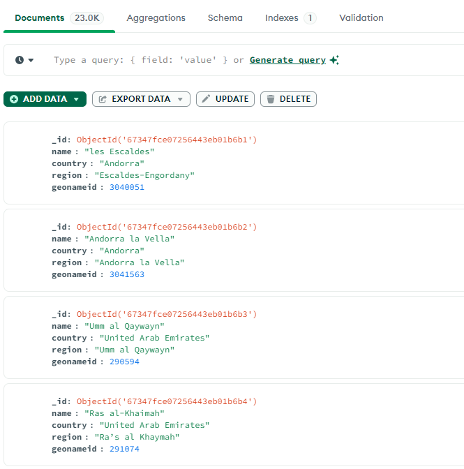
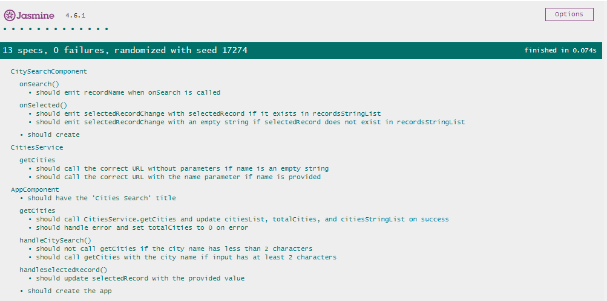
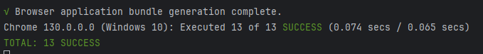

# City Finder

This project can be run on [www.worldcities.pete85.com](https://worldcities.pete85.com/).

Code can be downloaded / cloned from [https://github.com/pete85/world-cities](https://github.com/pete85/world-cities).

## Introduction

For this test, I created a simple application consisting of **AppComponent** and its child **SearchComponent**. 

The SearchComponent contains an input field, where user input is passed up to the AppComponent. 
When the input reaches two or more characters, AppComponent triggers the _getCities() function, which uses 
CitiesService (CS) to make an HTTP request to my portfolio server. The CitiesService _getCities() function 
performs the HTTP request, and AppComponent subscribes to the response.








## Implementation

### AppComponent

___

**getCities(name: string)**

```typescript
getCities(name: string) {
  this.totalCities = 0;
  this.subCities$ = this._citiesService.getCities(name).subscribe(
    {
      next: response => {
        this.subscriptionList.add(this.subCities$);
        if (response) {
          this.citiesList = response.data;
          this.totalCities = response.totalRecords;
          this.citiesStringList = response.data.map(
            (el: City) => `${el.name}, ${el.region || ''} (${el.country})`.replace(/\s\|\s$/, '')
          );
        }
      },
      error: err => {
        this.totalCities = 0;
        console.error(err);
      }
    }
  );
}
```

### SearchComponent

Search component is a generic component. It was built with reusability in mind. Therefore, no direct references
to cities, countries and regions are made there. With this setup, it can serve as an autocomplete component for 
different data sets.

It passes the emitted search string as well as selected record. It also takes the formatted array of strings
as an _@Input_.

```angular2html
<app-search (recordName)="handleCitySearch($event)" [recordsStringList]="citiesStringList"
            (selectedRecordChange)="handleSelectedRecord($event)"></app-search>
```

### Interface

```typescript
export interface Cities {
  data: City[];
  totalRecords: number;
}

export interface City {
  name: string;
  country: string;
  region?: string;
  geonameid?: number;
}
```

### Data source

After analyzing the **world-cities.txt**, I realised that serving data directly from the .txt file has several downsides.
Those include the following:
* Large files can lead to significant delays in reading data, as the entire file might need to be loaded into memory each time a request is made.
* A .txt file doesn’t support efficient filtering, indexing, or searching. Every search operation would involve scanning the file line-by-line, which becomes inefficient with larger files.
* For an autocomplete feature that requires rapid, partial-text matching, a database with indexing is far superior. MongoDB, for example, can perform partial or full-text searches efficiently through indexing, while a .txt file cannot
* .txt files lack structured data management, making it easy for entries to become inconsistent or contain errors.

Taking the above into consideration, as well as making sure the work is completed inline with the requirements, I decided to follow the database path.

#### Serving data

the first step was to produce a JSON file for all records. 
As one of the requirements was to write a webserver, I decided to utilise my Portfolio's existing server,
built with Node.js and Express. Data is stored in MongoDB.

There was one obstacle to overcome - duplicated records. As all city names are valid and belong to different regions of the world, 
I thought it would be good to enhance the JSON by adding **country** and **region** fields. Unfortunately, with such a
large dataset, even utilising ChatGPT was problematic. Luckily, I found the exact same dataset in JSON, including
all fields I was after. This was found on [codesandbox.io](https://codesandbox.io/p/github/riyantowibowo/world-cities-json/main?file=%2Fdata%2Fcities.json%3A38495%2C20-38495%2C29).

Having accurate and full data in place, I triggered the process of setting up the back-end server and populating 
MongoDB collection with data.

#### Node.js with Express server

As I have built this server for my portfolio (to serve my skills, experience and project data), all I had to do was to
add the schema and configure the cities route.


___

**Schema**
```javascript
const mongoose = require('mongoose');

const CitySchema = new mongoose.Schema({
  name: {
    type: String,
    required: true
  },
  country: {
    type: String,
    required: true
  },
  region: {
    type: String,
    required: false
  },
  geonameid: {
    type: Number,
    required: false
  }
});

module.exports = mongoose.model('Cities', CitySchema);

```

___

**Cities Route**

```javascript
require('dotenv').config();
const express = require('express');
const router = express.Router();
module.exports = router;
const Cities = require('../models/cities');

/**
 * GET cities (all cities or by partial name)
 */
router.get('/cities', async (req, res) => {
  try {
    // Get the query parameter for name
    const { name } = req.query;

    // Construct the query based on the presence of 'name'
    const query = name ? { name: new RegExp(name, 'i') } : {};

    // Fetch data based on the query
    const data = await Cities.find(query);

    // Send response with data and total count
    res.json({
      data,
      totalRecords: data.length
    });
  }
  catch (error) {
    res.status(500).json({ message: error.message });
  }
});


```

##### MongoDB

The above setup generated the **cities** collection in my database. I just had to import data from the JSON file.



## Testing

I wrote unit tests for both AppComponent and SearchComponent, as well as the CitiesService. Tests cover all methods written for this task.





## Development server

Run `ng serve` for a dev server. Navigate to `http://localhost:4200/`. The application will automatically reload if you change any of the source files.

## Code scaffolding

Run `ng generate component component-name` to generate a new component. You can also use `ng generate directive|pipe|service|class|guard|interface|enum|module`.

## Build

Run `ng build` to build the project. The build artifacts will be stored in the `dist/` directory.

## Running unit tests

Run `ng test` to execute the unit tests via [Karma](https://karma-runner.github.io).

## Running end-to-end tests

Run `ng e2e` to execute the end-to-end tests via a platform of your choice. To use this command, you need to first add a package that implements end-to-end testing capabilities.

## Further help

To get more help on the Angular CLI use `ng help` or go check out the [Angular CLI Overview and Command Reference](https://angular.dev/tools/cli) page.

This project was generated with [Angular CLI](https://github.com/angular/angular-cli) version 18.2.11.
